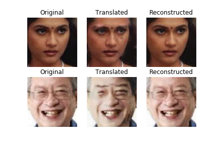
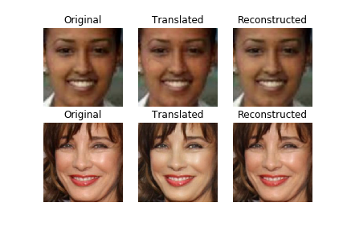

# Face Aging using CycleGAN

## Dataset

[UTKFace - Large Scale Face Dataset](https://susanqq.github.io/UTKFace/)

- Consists of 20,000+ face images (Only single face in one image)
- Correspondingly aligned & cropped faces
- Images are labelled by age and gender

For Face Aging, _**young**_ is taken as images with age range between 18-25, and ***old*** is taken as images between 50-60.

Trained on total 2073 images.

After training for **100 epochs**:

***Top Row***:         young -> old
***Bottom Row***:  old -> young

Training for 200 epochs should improve the results and be able to re-produce the original results.

