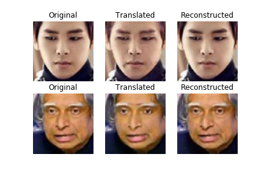

# Face Aging using CycleGAN

## Dataset

[UTKFace - Large Scale Face Dataset](https://susanqq.github.io/UTKFace/)

- Consists of 20,000+ face images (Only single face in one image)
- Correspondingly aligned & cropped faces
- Images are labelled by age and gender

For Face Aging, _**young**_ is taken as images with age range between 18-25, and ***old*** is taken as images between 50-60.

Trained on total 2073 images.

After training for **100 epochs**:

***Top Row***:         young -> old

***Bottom Row***:  old -> young

Training for 200 epochs should improve the results and be able to re-produce the original results.

## Failed Experiments

Tried training CyclicGAN with an additional label constraint (whether the person in the image is wearing glasses or not). 
Separate discriminators is added for this, and generator's input (the input image) is multiplied with an embedding of the label.
Additional loss function - Mutual Info Loss is added.
However, the generator isn't able to produce meaningful images after adding this additional constraint.
The code for this is added in `Failed-Experiments`
